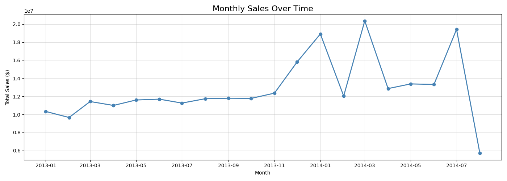
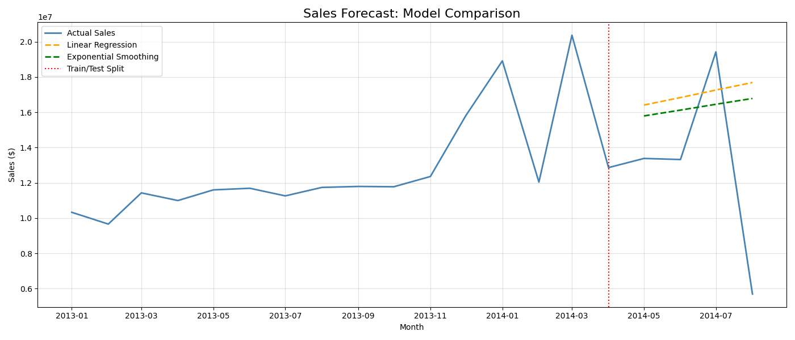
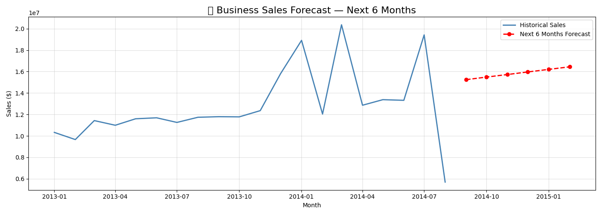

# 🔮 Sales & Demand Forecasting — Future Interns ML Task 1

## 📌 Objective
Build a machine learning model to forecast future monthly sales using historical business data, and generate business-ready insights and visualizations.

---

## 📦 Dataset
- **Source:** Kaggle — Store Sales Time Series Forecasting
- **File used:** `train.csv` (renamed to `sales_data.csv`)
- **Columns:** `date`, `store_nbr`, `family`, `sales`, `onpromotion`
- **Size:** 3+ years of daily retail sales data across multiple stores

---

## 🛠️ Tools & Libraries

| Tool | Purpose |
|------|---------|
| Python 3.13 | Core programming language |
| Pandas | Data loading, cleaning, feature engineering |
| NumPy | Numerical computations |
| Matplotlib | Data visualization & charts |
| Scikit-learn | Linear Regression model |
| Statsmodels | Exponential Smoothing model |
| Jupyter Notebook | Development environment |

---

## 🔄 Project Pipeline

1. **Data Loading** — Loaded CSV using pandas, explored shape and columns
2. **Data Cleaning** — Parsed DD-MM-YYYY dates, sorted by time
3. **Feature Engineering** — Aggregated daily sales into monthly totals
4. **Visualization** — Plotted historical sales trend
5. **Train/Test Split** — 80% train, 20% test (time-based, not random)
6. **Model Training** — Linear Regression & Exponential Smoothing
7. **Model Evaluation** — Compared using MAE and RMSE
8. **Future Forecast** — Generated 6-month forward business forecast

---

## 📊 Model Results

| Model | MAE | RMSE |
|-------|-----|------|
| Linear Regression | $5,173,396.64 | $6,518,366.16 |
| Exponential Smoothing | $4,817,540.03 | $6,029,418.79 |

> ✅ **Best Model: Exponential Smoothing** — Lower MAE and RMSE than Linear Regression

---

## 📈 Visualizations

### Sales Trend Over Time


### Model Forecast Comparison


### 6-Month Future Forecast


---

## 💡 Key Business Insights
- Exponential Smoothing outperformed Linear Regression on this dataset
- Recent sales patterns carry more weight than older historical data
- The 6-month forecast provides actionable inventory planning data
- Time-based train/test split used to prevent data leakage

---

## ✅ Skills Gained
- Time-series analysis & forecasting
- Data cleaning & feature engineering
- Model evaluation with MAE & RMSE
- Business-ready data visualization
- End-to-end ML pipeline development

---

## 📁 Repository Structure
```
FUTURE_ML_01/
├── forecasting.ipynb        ← Full Jupyter Notebook with code & outputs
├── sales_data.csv           ← Dataset (Kaggle Store Sales)
├── sales_trend.png          ← Historical sales trend chart
├── forecast_comparison.png  ← Model comparison chart
├── future_forecast.png      ← 6-month future forecast chart
└── README.md                ← Project documentation
```
